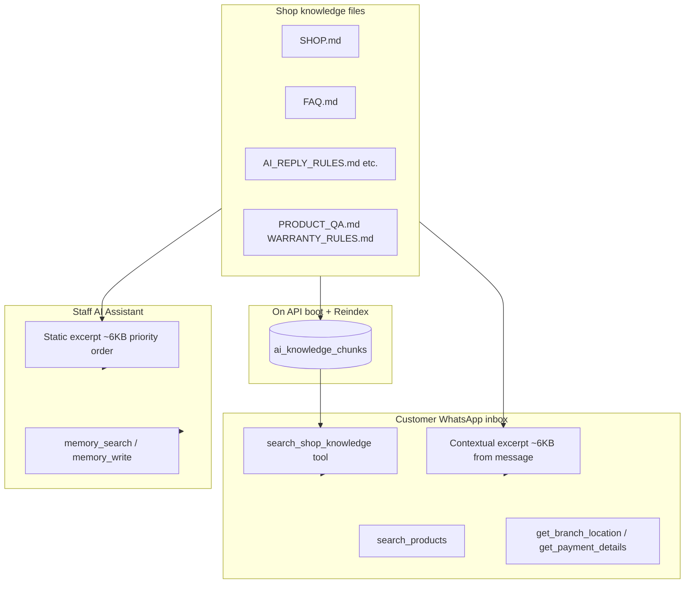

# AI markdown files — what the bot reads and how to fill them

Use this guide to know **which files your AI actually uses**, **how they are loaded**, and **what to write in each file**.

> **Your Docker API right now (check):** 9 knowledge files indexed, **44 chunks**. Memory: **1 file** (`MEMORY.md`), **1 chunk**.  
> After you edit files in **Settings → Shop knowledge** or **Settings → AI memory**, click **Reindex** (or save — auto-reindexes that file).

---

## Quick answer: is the AI fetching all of them?

| Source | Fetched? | How |
|--------|----------|-----|
| Every `.md` / `.txt` in `data/ai-knowledge/` | **Yes** — all are indexed on API boot (if `AI_KNOWLEDGE_AUTO_INDEX` is not `false`) | Chunked + embedded in DB; searchable via `search_shop_knowledge` |
| Prompt injection (first ~6 KB) | **Partial** — priority order below; may truncate long files | `buildPromptExcerpt()` / `buildContextualPromptExcerpt()` |
| `data/ai-memory/*.md` | **Staff AI only** — not customer inbox | `memory_search`, `memory_get`, `memory_write` tools |
| **Branch AI profile** (location, payment) | **Yes** — live from database | `get_branch_location`, `get_payment_details` tools — **not** from markdown |
| **Product catalog** | **Yes** — live from database | `search_products` tool |
| **AI Learning reply samples** | **Yes** — from imported WhatsApp CSV | Injected into customer prompt when imports exist |
| Hardcoded inbox rules | **Yes** | `ai-inbox-reply-rules.ts` (not editable in Settings) |

**Toggles (Settings → Provider & API):**

- **Shop Knowledge (RAG)** `knowledgeRagEnabled` — off = no knowledge excerpt in prompts; customer `search_shop_knowledge` still works if tool calling is on.
- **Neural Memory** `memoryRagEnabled` — off = staff `memory_*` tools disabled.

---

## How the AI uses knowledge (flow)



### Customer inbox (auto-reply)

1. Builds system prompt with **recent chat**, CRM, hardcoded reply rules.
2. Injects **relevant knowledge snippets** (~6,000 chars max) matched to the customer’s message.
3. Model may call **`search_shop_knowledge`** for deeper hits across **all** indexed files.
4. Model must call **`get_branch_location`** / **`get_payment_details`** for address and lipa namba — do not put those in markdown if you use Branch profile.
5. Model must call **`search_products`** for prices/stock.

### Staff AI Assistant

1. Injects **static shop knowledge excerpt** (~6,000 chars, priority order below).
2. Uses **`memory_search`** / **`memory_write`** for long-term staff facts (`MEMORY.md`).
3. Uses live tools (pipeline, inbox, products, etc.) — same as dashboard.

---

## File locations

| Environment | Shop knowledge | AI memory |
|-------------|----------------|-----------|
| Docker API | `/app/data/ai-knowledge/` (volume `openwa-data`) | `/app/data/ai-memory/` |
| Local dev | `./data/ai-knowledge/` | `./data/ai-memory/` |
| Desktop app | `~/Library/Application Support/Inauzwa CRM/ai-knowledge/` | `.../ai-memory/` |
| Bundled templates | `seed/ai-knowledge/` (copied/synced on API boot) | Auto-created `MEMORY.md` on first boot |

**Edit in dashboard:** Settings → **Shop knowledge** / **AI memory**  
**After bulk edits:** Settings → **Reindex knowledge** / **Reindex memory**

---

## Prompt priority (what fits in the first ~6 KB)

When the full files do not fit, this order is used first:

1. `AI_REPLY_RULES.md`
2. `SHOP.md`
3. `BRANCH_PROFILE_AND_PAYMENT_SETTINGS.md`
4. `DISCOUNT_ESCALATION_RULES.md`
5. `INSTALLMENT_PRODUCT_RULES.md`
6. `POLICIES.md` (optional — create if you want)
7. `FAQ.md`
8. **All other** `.md` files (alphabetically), including `PRODUCT_QA.md`, `WARRANTY_RULES.md`, `FAQ_KNOWLEDGE.md`

**Important:** Stub files with only a title line still get indexed and found via **`search_shop_knowledge`**, but add real content or the tool returns little useful text.

---

## Bundled vs editable files

| File | Boot behavior | You should |
|------|---------------|------------|
| `AI_REPLY_RULES.md` | **Re-synced from seed** when content differs | Edit seed in repo if you change behavior rules; or accept re-sync on deploy |
| `BRANCH_PROFILE_AND_PAYMENT_SETTINGS.md` | Re-synced from seed | Keep as instructions; real data lives in **Branch AI profile** |
| `DISCOUNT_ESCALATION_RULES.md` | Re-synced from seed | Customize discount script in seed or accept sync |
| `INSTALLMENT_PRODUCT_RULES.md` | Re-synced from seed | Per-product installment still comes from **Products** |
| `SHOP.md`, `FAQ.md` | Copied from seed only if **missing or &lt;200 bytes** | **Your main editable shop docs** |
| `FAQ_KNOWLEDGE.md`, `PRODUCT_QA.md`, `WARRANTY_RULES.md` | Copied once if missing | Fill manually **or** via **AI Learning → Approve** (see below) |

---

# Shop knowledge files — what to put in each

## 1. `SHOP.md` — your business overview

**Used by:** Customer + staff  
**Purpose:** High-level shop facts, delivery, warranty summary, what *not* to hardcode.

```markdown
# Shop knowledge — [Your business name]

## Business
- **Name:**
- **What you sell:**
- **Branches / cities:**
- **Tone:** Boss-friendly mtaani (see AI_REPLY_RULES.md)

## Delivery & pickup
- Pickup: [where / when]
- Delivery areas: [list or “ask staff”]
- Typical fees: [or “see branch deliveryPolicy in settings”]

## Warranty & condition (summary)
- New vs used vs refurb: [how you describe each]
- Default warranty: [or “see branch warrantyPolicy”]

## Trade-in / exchange
- [Policy — usually “staff must quote”]

## Special topics
- iCloud / passcode policy:
- Accessories vs devices:
- Anything unique to your shop:

## Do NOT put here
- M-Pesa / bank numbers → **Branch AI profile → Payment accounts**
- Full street address / maps → **Branch AI profile**
- Live prices → **Products catalog**
```

---

## 2. `FAQ.md` — customer Q&A patterns

**Used by:** Customer + staff (high priority in prompt)  
**Purpose:** Example questions and approved answer patterns.

```markdown
# FAQ — [Your business]

Use **Q:** / **A:** blocks. One topic per section.

## Greeting
**Q:** Mambo / Habari / Hi
**A:** [Short greeting only — no “unatafuta nini?”]

## Availability
**Q:** Ipo? / Kuna iPhone 14?
**A:** [Search products; format • Name — Price]

## Price
**Q:** Bei gani?
**A:** [Ask model if unclear; quote from catalog]

## Location
**Q:** Mko wapi?
**A:** [Ask Dar/Arusha if needed; use branch profile tools]

## Payment
**Q:** Lipa namba?
**A:** [Use get_payment_details — not text from this file]

## Installment
**Q:** Mnafanya installment?
**A:** [Only if product installmentEnabled]

## Warranty
**Q:** Dhamana ipo?
**A:** [Use branch warrantyPolicy or escalate]

## Discount
**Q:** Punguza bei
**A:** [See DISCOUNT_ESCALATION_RULES.md]

---
_Add more sections as you learn from real chats._
```

**AI Learning note:** When you approve an item targeting `FAQ_KNOWLEDGE.md`, the system **appends to `FAQ.md`**, not to `FAQ_KNOWLEDGE.md`. You can delete or ignore the stub `FAQ_KNOWLEDGE.md` file, or keep it as a label only.

---

## 3. `AI_REPLY_RULES.md` — how the bot should behave

**Used by:** Customer (in prompt + hardcoded overlap)  
**Purpose:** Tone, greeting rules, context, stock formatting, groups, escalation triggers.

**Do not empty this file.** It is re-synced from `seed/ai-knowledge/` on deploy when seed changes.

**Customize by editing:** `seed/ai-knowledge/AI_REPLY_RULES.md` in the repo, then redeploy — or edit in Settings knowing deploy may overwrite.

Key sections already in seed:

- Tone (Boss / mtaani)
- Greeting-only replies
- Read context before “ipo?”
- Product list format (no stock counts to customers)
- Group chat behavior
- When to escalate

---

## 4. `BRANCH_PROFILE_AND_PAYMENT_SETTINGS.md` — instructions for the model

**Used by:** Customer + staff  
**Purpose:** Tells the AI to use **Settings → Branch AI profile**, not markdown, for:

- `locationDescription`, `googleMapsUrl`, `openingHours`, `phoneNumbers`
- `deliveryPolicy`, `warrantyPolicy`, `installmentPolicyDefault`
- Payment accounts (`get_payment_details`)

**Your action:** Fill **Settings → Branch AI profile** for each branch (Dar, Arusha, etc.) and add **Payment accounts**. This markdown file explains the rule; it does not replace the forms.

---

## 5. `DISCOUNT_ESCALATION_RULES.md` — discount defense + handoff

**Used by:** Customer  
**Purpose:** First discount request = polite price defense (varied wording). Second request = “nitakurudia” then pause AI / human.

Edit in seed or Settings. Match your real discount authority.

---

## 6. `INSTALLMENT_PRODUCT_RULES.md` — installment logic

**Used by:** Customer  
**Purpose:** Only offer installment when `installmentEnabled` on the product from `search_products`.

**Your action:** Enable installment per product in **Products → Installment** tab. This file explains how the AI should talk about it.

---

## 7. `PRODUCT_QA.md` — product-specific Q&A

**Used by:** Customer via search + prompt (lower priority if truncated)  
**Purpose:** Approved answers about specific models, compatibility, accessories.

```markdown
# Product Q&A

### iPhone 14 — charger compatible?
_Approved YYYY-MM-DD · accessories_

**Q:** Charger ya iPhone 14 mnayo?
**A:** Ndiyo Boss, tuna [product name] — bei [from catalog].

### MacBook Air M1 — RAM upgrade?
**Q:** Mnaweza kuongeza RAM?
**A:** [Your policy — often “stock configuration only”]

---
_Add one ### heading per approved pattern from AI Learning._
```

---

## 8. `WARRANTY_RULES.md` — warranty & returns detail

**Used by:** Customer via search  
**Purpose:** Longer warranty/return rules than `SHOP.md` summary.

```markdown
# Warranty Rules

## New devices
- Period:
- What is covered:
- What is not covered:

## Used / refurb
- Period:
- Battery / screen exclusions:

## Returns & exchanges
- Window:
- Condition required:
- Refund method:

## How to claim
- Bring receipt / WhatsApp proof:
- Branch handling time:
```

---

## 9. `FAQ_KNOWLEDGE.md` — optional stub

**Used by:** Indexed if present, but **AI Learning approvals go to `FAQ.md`** instead.  
**Recommendation:** Put FAQ content in **`FAQ.md`** only; ignore or delete this stub to avoid confusion.

---

## 10. Optional extra files (create in Settings → Shop knowledge)

These are listed in AI Learning UI but not in seed. Create as new files — they are indexed automatically:

| File | Suggested content |
|------|-------------------|
| `DELIVERY_RULES.md` | Zones, fees, timelines, “mikoani” rules |
| `PAYMENT_RULES.md` | Payment methods accepted (not account numbers) |
| `INSTALLMENT_RULES.md` | Business-wide installment policy (supplements per-product settings) |
| `POLICIES.md` | Privacy, refunds, complaints |
| `AI_REPLY_EXAMPLES.md` | Good/bad reply examples for tone training |

---

# AI memory — staff only

## `MEMORY.md` (folder: `data/ai-memory/`)

**Used by:** Staff AI Assistant only — **not** customer WhatsApp auto-reply.

```markdown
# Long-term memory

Facts the staff assistant should remember across chats.

## Customer preferences
- (YYYY-MM-DD) [Customer name / phone]: prefers Dar branch, buys iPhones

## Pricing decisions
- (YYYY-MM-DD) Repeat MacBook buyers: up to 5% discount needs manager OK

## Internal policies
- (YYYY-MM-DD) We do not sell iCloud-locked devices

## Promoted by Memory Dream
- [dream] snippets auto-appended when recalled often
```

**Tools:** `memory_search`, `memory_get`, `memory_write`, `memory_list_files`  
**Dream (admin):** Settings → AI memory → **Run memory dream** — promotes frequently recalled chunks into `MEMORY.md`.  
**Schedule:** `AI_MEMORY_DREAM_INTERVAL_HOURS=24` in `.env` (0 = off).

You can add more `.md` files under `ai-memory/` (e.g. `STAFF_NOTES.md`).

---

# What is NOT in markdown (but the AI still uses)

| Data | Where to configure |
|------|-------------------|
| Branch address, hours, maps, phones | Settings → **Branch AI profile** |
| M-Pesa / bank numbers | Settings → **Branch AI profile → Payment accounts** |
| Product prices, stock, installment flags | **Products** catalog (+ Inauzwa sync) |
| Auto-reply tone / preset | **Automations → AI Auto-reply** or Settings → Provider & API |
| Learned reply style from archives | **AI Learning** — imports WhatsApp CSV; samples injected into customer prompt |
| Approved FAQ from learning queue | Appends to `FAQ.md`, `PRODUCT_QA.md`, or `WARRANTY_RULES.md` |

---

# Checklist after you update files

1. [ ] **SHOP.md** — business name, delivery, warranty summary filled
2. [ ] **FAQ.md** — top 10–20 real customer questions
3. [ ] **Branch AI profile** — every branch has location, hours, delivery/warranty text
4. [ ] **Payment accounts** — active lipa namba per branch
5. [ ] **PRODUCT_QA.md** / **WARRANTY_RULES.md** — filled or approved via AI Learning
6. [ ] Settings → Shop knowledge → **Reindex knowledge** (target: **≥15 chunks** for setup checklist)
7. [ ] Settings → Provider & API — **Shop Knowledge (RAG)** ON
8. [ ] Test inbox: ask warranty, location, lipa namba, product price — confirm tools are used
9. [ ] **MEMORY.md** — staff-only facts; reindex memory if edited on disk

---

# Verify indexing (Docker)

```bash
# List files in the running API container
docker exec openwa-api ls -la /app/data/ai-knowledge/

# Recent index log (should show 9 files, ~44 chunks after full seed)
docker logs openwa-api 2>&1 | grep "Knowledge index" | tail -3

# Re-sync host seed into container if volume was empty
./scripts/sync-ai-knowledge-docker.sh
```

---

# Summary table

| File | Customer inbox | Staff AI | Primary fill method |
|------|----------------|----------|---------------------|
| `SHOP.md` | Prompt + search | Prompt + search | You edit |
| `FAQ.md` | Prompt + search | Prompt + search | You edit + AI Learning |
| `AI_REPLY_RULES.md` | Prompt + search | Prompt + search | Seed / deploy |
| `BRANCH_PROFILE_AND_PAYMENT_SETTINGS.md` | Prompt + search | Prompt + search | Seed (data in Branch profile) |
| `DISCOUNT_ESCALATION_RULES.md` | Prompt + search | Prompt + search | Seed / you |
| `INSTALLMENT_PRODUCT_RULES.md` | Prompt + search | Prompt + search | Seed + Products |
| `PRODUCT_QA.md` | Search (+ prompt if room) | Same | You + AI Learning |
| `WARRANTY_RULES.md` | Search (+ prompt if room) | Same | You + AI Learning |
| `FAQ_KNOWLEDGE.md` | Search only (stub) | Same | Prefer `FAQ.md` instead |
| `MEMORY.md` | **No** | memory tools | Staff chat + you |

_Last updated: 2026-06-10 — matches OpenWA `ai-knowledge.service.ts` and inbox agent behavior._
